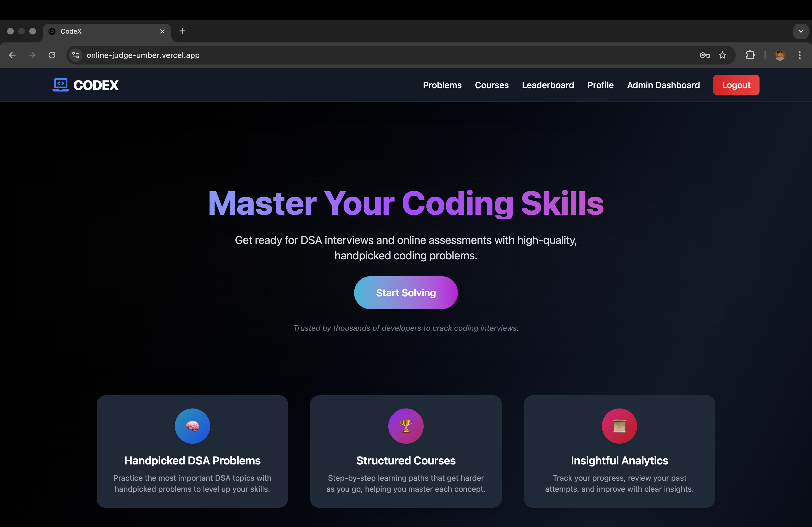
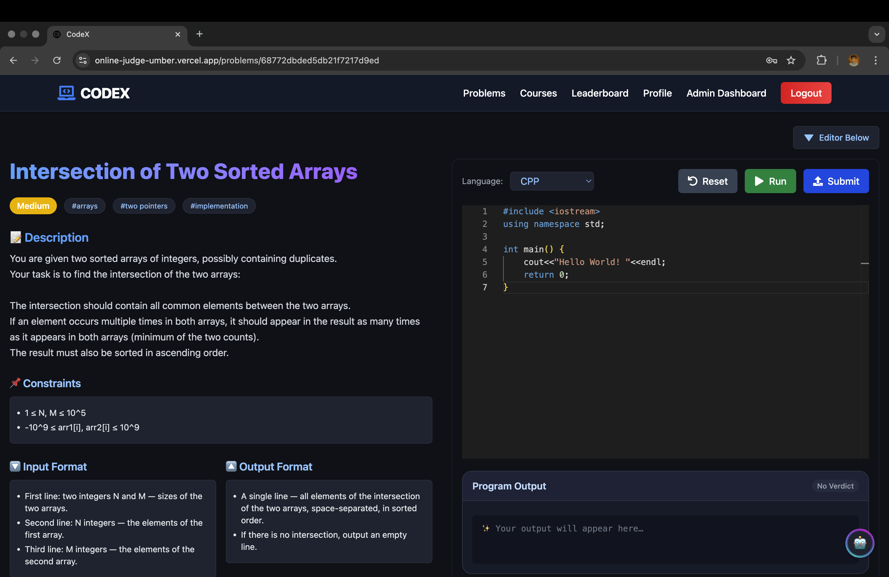
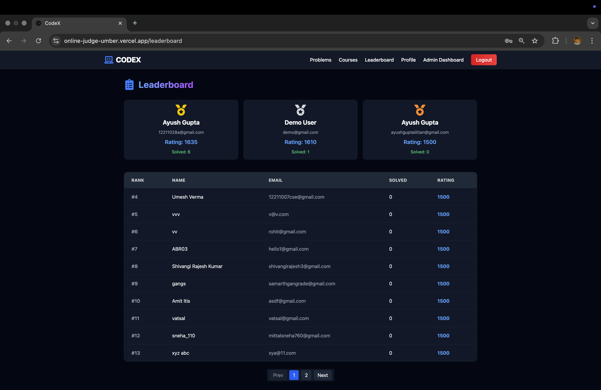
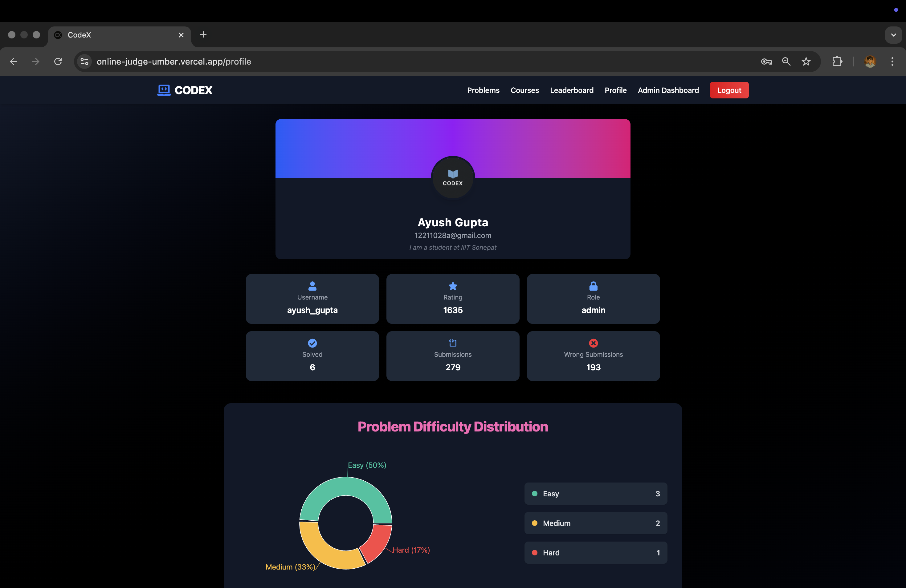
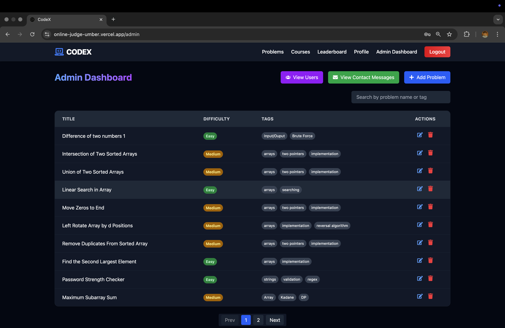

# 💻 CodeX — MERN Online Judge Platform

> 🚀 **A scalable, full-stack DSA practice & coding platform, powered by MERN, Docker & AWS.**

CodeX is a modern, feature-rich **Data Structures & Algorithms (DSA) practice platform** built on the **MERN stack**, Docker, Redux Toolkit, and AWS.  
It lets users solve coding problems, run and submit code in a sandboxed environment, track progress, view leaderboards — all with a blazing-fast, intuitive interface and a robust backend.

---

## ✨ Features

### 👩‍💻 For Users
✅ Browse, filter, and solve DSA problems by **difficulty** and **status**  
✅ In-browser **code editor** with syntax highlighting & custom input  
✅ Get **execution time & memory** usage for each submission  
✅ View all your submissions & **problem history**  
✅ Compete on a live **leaderboard** & improve your rating  
✅ Manage your **profile**, track solved count & progress

### 🧑‍💼 For Admin
✅ Web-based **admin dashboard**  
✅ Create, edit & delete DSA problems  
✅ View and respond to user **contact messages**

---

## 📸 Screenshots

| 🏠 Home Page | 📝 Code Editor |
|--------------|----------------|
|  |  |

| 🏆 Leaderboard | 👤 Profile Page |
|----------------|-----------------|
|  |  |

| 🧑‍💼 Admin Dashboard | |
|-----------------------|--|
|  | |
## 🧰 Tech Stack & Architecture

### 🌐 Frontend
- ⚛️ **React** + **Redux Toolkit** + **Redux Persist**
- React Router DOM, Framer Motion, Recharts, SweetAlert2
- TailwindCSS + DaisyUI
- Vite for blazing-fast builds, lazy loading & Suspense, skeleton loaders
- Deployed on **Vercel**
- Features:
  - User Auth & Profile (Login/Signup, onboarding, update/delete profile)
  - Problem Solving Interface with editor, language selector, AI utilities (review, boilerplate, hint), custom input, run/reset/submit
  - Leaderboard showing user rankings & rating
  - Problems Page with list/search/sort by difficulty & status in card/table view
  - Admin Panel for CRUD operations, user & message management, admin role management
  - User Submissions pages (per-problem & all)

---

### 🖥️ Backend 1: CRUD Server
- Node.js + Express.js
- MongoDB Atlas + Mongoose
- JWT-based authentication with HttpOnly cookies
- Redis caching with invalidation
- REST APIs hosted on **Railway**
- Features:
  - Auth endpoints: login, signup, logout, onboarding, user info
  - User endpoints: leaderboard, profile stats, submissions, admin actions (make/remove admin, view users)
  - Problem endpoints: CRUD, batch create, per-user status
  - Submissions: save, retrieve, track per test case results
  - AI Utilities: code review, hint, boilerplate, testcase generation
  - Contact Messages: submit/view
  - Middleware:
    - `authMiddleware`, `optionalAuth`, `adminOnly`, `superadminOnly`
  - Centralized error handling with custom error class
  - Caching common queries using Redis
- Endpoints:
  - **Auth:** `/api/auth/*` (signup, login, logout, onboarding, me)
  - **User:** `/api/user/*` (update-account, delete-account, leaderboard, profile-stats, submissions, admin actions)
  - **Problem:** `/api/problem/*` (all, by id, status, admin CRUD, batch-create)
  - **Submission:** `/api/submission/*` (submit, by user, by id)
  - **AI:** `/api/ai/*` (review, generate-hint, generate-boilerplate, generate-testcases)
  - **Contact:** `/api/contact/*` (submit, admin/all)

---

### 🖥️ Backend 2: Compiler Server
- Node.js + Express.js
- Docker-based sandboxed, horizontally scalable code execution
- Hosted on **AWS EC2 + ECR + Elastic IP**
- Handles both `/run` & `/submit` requests:
  - **/run:** executes code with custom input on-demand
  - **/submit:** full submission processing through a message queue
- RabbitMQ used as message queue for submissions
- Workers:
  - Compiler workers (inside Docker containers) pull submissions from RabbitMQ
  - Compiled languages: compile once, then run binary on all test cases
  - Interpreted languages: run script per test case
  - Stops execution on first failure or timeout (TLE, MLE, RE)
  - Updates verdict & results in MongoDB, cleans up files
  - Horizontally scalable at both container & worker level
- Deployed with NGINX reverse proxy & SSL (Certbot) for HTTPS
- Future-ready for WebSocket-based real-time verdicts

---

### 🗃️ Other Components

| Layer                | Technology                        |
|-----------------------|-----------------------------------|
| **Database**         | MongoDB Atlas                     |
| **Message Queue**     | RabbitMQ (cloud hosted)           |
| **Cache**             | Redis                             |
| **Frontend Hosting**  | Vercel                            |
| **CRUD Hosting**      | Railway                           |
| **Compiler Hosting**  | AWS (EC2 + Docker + Elastic IP)   |
| **Containerization**  | Docker                            |
| **Authentication**    | JWT + HTTP-only cookies           |

### 📊 Deployment Diagram

```
            +-------------------+
            |      Users        |
            +-------------------+
                    |
                    v
            [ Vercel Frontend ]
                    |
        +-----------+-----------+
        |                       |
  [ CRUD Backend ]        [ Compiler Backend ]
(Railway, REST APIs)   (AWS EC2 + Docker, REST)
        |
 [ MongoDB Atlas ]
        |
  [ Redis Cache ]
```